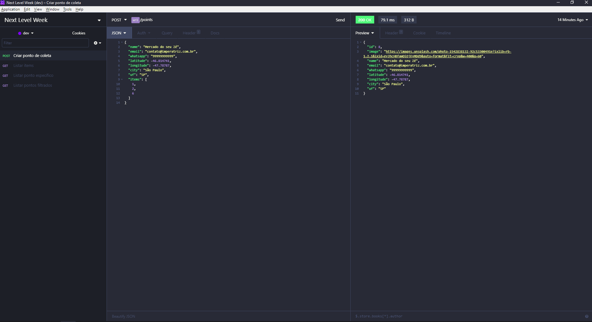

<h1 align="center">
  
  <br/>
  
</h1>

<p align="center">
  

  
  
  <a href="https://github.com/yalves/ecoleta/commits/master">
    
  </a>

  <a href="https://github.com/yalves/ecoleta/issues">
    
  </a>

  <a href="https://github.com/yalves/ecoleta/blob/master/LICENSE.md">
    
  <a>
</p>

<p align="center">
  <a href="#-tecnologias">Technologies</a>&nbsp;&nbsp;&nbsp;|&nbsp;&nbsp;&nbsp;
  <a href="#-projeto">Project</a>&nbsp;&nbsp;&nbsp;|&nbsp;&nbsp;&nbsp;
  <a href="#-backend">Backend</a>&nbsp;&nbsp;&nbsp;|&nbsp;&nbsp;&nbsp;
  <a href="#-frontend">Frontend</a>&nbsp;&nbsp;&nbsp;|&nbsp;&nbsp;&nbsp;
  <a href="#-mobile">Mobile</a>&nbsp;&nbsp;&nbsp;|&nbsp;&nbsp;&nbsp;
  <a href="#-instalação">Installing</a>&nbsp;&nbsp;&nbsp;|&nbsp;&nbsp;&nbsp;
  <a href="#-instalação">Contributing</a>&nbsp;&nbsp;&nbsp;|&nbsp;&nbsp;&nbsp;
  <a href="#-licença">License</a>
</p>

<br>


---

## 🚀 Tecnologias

This project was developed using this technologies:

- [Node.js](https://nodejs.org/en/)
- [React](https://reactjs.org)
- [React Native](https://facebook.github.io/react-native/)
- [Expo](https://expo.io/)
- [IBGE API to query addresses](https://servicodados.ibge.gov.br/api/docs/localidades?versao=1#api-UFs-estadosGet)
- [Images upload](react-dropzone)
- [Leaflet](https://leafletjs.com/examples/quick-start/)
- [Celebrate](https://github.com/arb/celebrate) 

## 💻 Project
The project was developed during the <strong>Next Level Week</strong> with ecological interests

The <strong>Ecoleta</strong> platform serves as a marketplace, a connection between companies or entities that collect waste, whether organic or inorganic, to people who need to dispose it.

## 🔨 Backend
<h1 align="center">
<a href="https://insomnia.rest/run/?label=Ecoleta&uri=https://raw.githubusercontent.com/yalves/ecoleta/master/.github/Insomnia-ecoleta-yalves.json" target="_blank"></a>
</h1>

## 🌐 Frontend
<h1 align="center">
    
</h1>

## 📱 Mobile
<h1 align="center">
    
</h1>

## 🔥 Installing

```bash
# Clone this repository
$ git clone git@github.com:yalves/ecoleta.git

# Navigate into each folder: ecoleta-server / ecoleta-web / ecoleta-mobile and install the dependencies:
$ yarn install

# Navigate to the ecoleta-server folder and run the following commands:
$ yarn knex:migrate
$ yarn knex:seed
$ yarn run dev

# Navigate to the ecoleta-web folder and run this command:
$ yarn start

# And finally, navigate to the ecoleta-mobile folder and run this command:
$ expo start

# Notes:
- Don't forget to change the baseURL in the api.ts file of the web and mobile folders to match your computer's ip
```


## 🤔 Contributing

- Fork this repository;
- Create a branch with your feature: `git checkout -b my-feature`;
- Commit your modifications: `git commit -m 'feat: My new feature'`;
- Push the code to your branch: `git push origin my-feature`.

After the merge of your pull request is done, you can delete your branch.


## 🧾 License

This project is under the MIT license. See the file [LICENSE](LICENSE.md) for details.

---

Made with 💗 by [Yan Alves](https://www.linkedin.com/in/yan-alves-monteiro-b8743810a/)